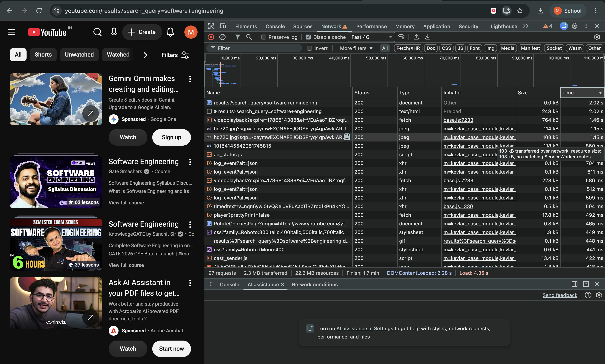

# Network Analysis

## Website
**Website:** You Tube 
**URL:** `https://www.youtube.com/results?search_query=software+engineering`

I open the website in Google Chrome, opened **DevTools → Network**, enabled **Disable cache**, and reloaded the page. I then inspected the Network waterfall and sorted the requests by the **Time** column.

## Network Summary

 Total requests  **97 requests** 
 Data transferred  **2.3 MB** 
 Total resources  **22.2 MB** 
 Finish time  **1.7 min** 
 DOMContentLoaded  **2.35 s** 
 Load event  **2.28 s** 
 Cache  **Disabled** 

 ## Single Slowest Resource

The slowest resource visible after sorting the Network panel by the **Time** column was:

- **Resource:** `https://www.youtube.com/results?search_query=software+engineering`
- **Status:** `200`
- **Type:** `document`
- **Size:** `0.0 kB`
- **Time:** **2.02 s**

## 3xx / 4xx Responses
- **3xx responses:** Yes — 302 redirects were visible.
- **4xx responses:** None visible in the captured Network panel.

## Observations

The Network panel shows that loading the YouTube search-results page required **97 HTTP requests**. 

The page transferred approximately **2.3 MB** of data, while the total listed resource size was approximately **22.2 MB**.

The Network panel shows that the DOM was loaded after approximately **2.28 seconds**, and the page load event occurred after approximately **4.35 seconds**. Network activity continued for approximately **1.17 minutes**.

The slowest resource visible in the captured Network panel was the main search-results document:

`results?search_query=software+engineering`

It took approximately **2.02 seconds**.

The visible requests returned `200 OK`. 1 `3xx` redirects and no `4xx` client-error responses are visible in this captured Network panel.

 ## Screenshot
 